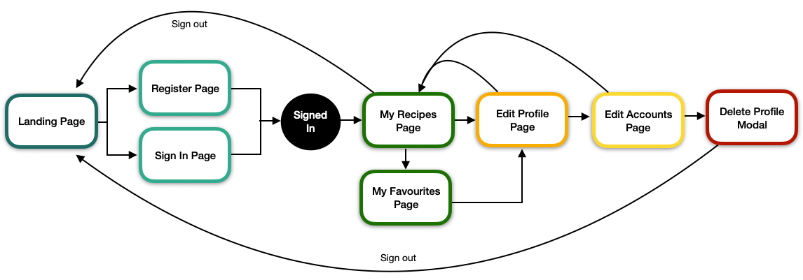
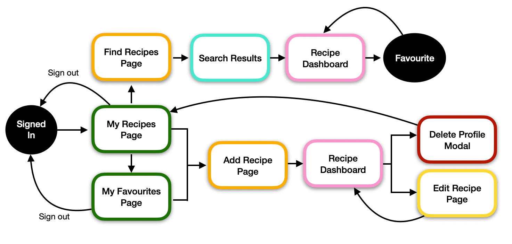

<h1 align="center">
     <a href="https://bake-it-til-you-make-it.herokuapp.com/" target="_blank"></a>
</h1>
<div align="center">

<strong><em>Bake It 'Til You Make It</em></strong> is a community-based web application for those who love the art of baking to search and share their favourite creations.

Inspired by the old-school baking book (filled with scrap paper and notes), the application features hand-drawn graphics and fonts designed to bring the users back to a time of scribbled recipes, in a more organised fashion, through a simplistic and intuitive user interface. 

The recipe database encourages users to create an account that will allow them to upload and store their favourite baking recipes as well as find new inspiration from other users, saving their favourites for later.

[View the live project here](https://bake-it-til-you-make-it.herokuapp.com/)

</div>

## Table of contents
1. [UX](#UX)
    1. [Project Goals](#Project-Goals)
    2. [User Stories](#User-Stories)
    3. [Development Planes](#Development-Planes)
2. [Features](#Features)
    1. [Design Features](#Design-Features) 
    2. [Existing Features](#Existing-Features)
    3. [Features to Implement in the future](#Features-to-Implement-in-the-future)
3. [Issues and Bugs](#Issues-and-Bugs)
4. [Information Architecture](#Information-Architecture)
5. [Technologies Used](#Technologies-Used)
     1. [Languages](#Languages)
     2. [Tools](#Tools)
     2. [Libraries](#Libraries)
6. [Testing](#Testing) ☞ **[Testing.md](TESTING.md)**
7. [Deployment](#Deployment)
     1. [1. Database Creation](#1-Database-Creation)
     2. [1. Local Copy Creation](#2-Local-Copy-Creation)
     3. [1. Heroku App Creation](#3-Heroku-App-Creation)
8. [Credits](#Credits)
9. [Acknowledgements](#Acknowledgements)
***


***

## UX 
### Project Goals
The primary goal of **Bake It 'Til You Make It** is to provide a web-based application, that is simplistic and intuitive in design, that allows users to create, search, save and share their favourite baking recipes on a database.

This is the third of four Milestone Projects that the developer must complete during their Full Stack Web Development Program at The Code Institute. 

The main requirements were to build a full-stack website allowing users to manage a common dataset (in this instance, baking recipes) using **HTML5**, **CSS3**, **JavaScript**, **Python**, **Flask** and **MongoDB**.

#### User Goals
The user is looking for:
- A searchable database to locate recipes of their choice.
- A easy-to-use user management system with **CRUD** conventions to:

    - Create a user account.
    - See their user information, as applicable.
    - Edit their user account.
    - Delete their user account.

- A easy-to-use dataset management system with **CRUD** conventions to:

    - Create recipes.
    - Read recipe dashboards.
    - Edit their own recipe creations.
    - Delete their own recipe creations.

- A intuitive and aesthetically pleasing interface.

#### Developer / Site Owner Goals
The Developer is looking to:

- Create an inviting, community-drive application that they themselves would use to share their passion for baking.
- Demonstrate their proficiency in a variety of software development skills, using newly learned languages and libraries as well as a document database system.
- Deploy a project they are proud and excited to have on their portfolio.


### User Stories
**As a General User, I want to:**

1. Intuitively find recipes on the database. 
2. View the selected recipe's dashboard to get necessary information.
3. Seek contact information to send useful feedback to Developer / Site Owner.

**As a Non-Registered User, I want to:**

1. Navigate to Sign-Up page to Register an account.

**As a Registered User, I want to:**

1. Log into my account to gain access to the full functionality of the site.
2. Navigate to my user profile to edit my account information.
3. Navigate to my account settings to delete my account information.
4. Navigate to my recipes page to view my uploaded recipes.
5. Navigate to upload page to add my recipe to the database.
6. View my own recipe's dashboard to edit recipe as needed.
7. View my own recipe's dashboard to delete recipe.
8. Use a save function to save my favourite recipes from other users.
9. Navigate to my favourites page to view the recipes I have saved from other users.

**As an Administrative Account holder, I want to:**

1. View **any** recipe dashboard to edit recipe as needed.
2. View **any** recipe dashboard to delete recipe as needed.
3. Still maintain a save function to save my favourite recipes from other users.

### Development Planes

In order to design and create a web-based interactive application, the developer distinguished the required functionality of the site and how it would answer the user stories, as described above, using the **Five Development Planes**:

<strong>1. <u>Strategy</u></strong>

Broken into three categories, the website will focus on the following target audiences:
- **Roles:**
     - Bakers of all levels
     - New Users **(Non-Registered)**
     - Return Users **(Registered)**

- **Demographic:**
     - Passion for baking
     - Food lovers
     - All ages (encouraging family fun-time)

- **Psychographics:**
     - Personality & Attitudes:
          - Organised
          - Creative
     - Values:
          - Community
          - Nostalgia
     - Lifestyles:
          - Food interests
          - Outgoing

The website needs to enable the **user** to:
- Register/Login to an account
- Search Recipe database by:
    - Name
    - Category
    - Level
- View Recipe Dashboard with the following information:
    - Name
    - Image URL
    - Description
    - Category
    - Serving Size
    - Time
    - Level
    - Ingredients
    - Directions
- Upload and access their own recipes
- Save and access their favourite recipes from other users
- Get in contact with site owner

The website needs to enable the **client** to:
- Provide a community-driven recipe database
- Use the website themselves:
    - Share their favourite recipes
    - Find new recipes
    - Connect with a community that shares their interests
    - Have control of the recipes shared
- Allow for user feedback and suggestions

With these goals in mind, a strategy table was created to determine the trade-off between importance and viability with the following results:

**Strategy Table for User Management:**


**Strategy Table for Baking Respository Management:**


<strong>2. <u>Scope</u></strong>

A scope was defined in order to clearly identify what needed to be done in order to align features with the strategy previously defined. This was broken into two categories:
- **Content Requirements**
     - The user will be looking for:
        - Customisable and Editable account:
            - Custom Username/Password
            - Custom User Image
            - Upload their own recipes
            - Save favourite recipes
        - Easy Navigation
        - Aesthetic theme (typography, imagery, colour palette)
        - Recipe dashboard:
            - Name
            - Image URL
            - Description
            - Category
            - Serving Size
            - Time
            - Level
            - Ingredients
            - Directions
        - Searchable database system
        - Developer contact information

- **Functionality Requirements**
     - The user will be able to:
        - Register/Login to account
        - Customise and edit their profile:
            - Custom Username/Password
            - Custom User Image
            - Upload their own recipes
            - Save favourite recipes
        - Navigate to recipes:
            - Search by name, category or level
            - My Recipes Page
            - My Favourites Page
        - Create recipes:
            - Name
            - Image URL
            - Description
            - Category
            - Serving Size
            - Time
            - Level
            - Ingredients
            - Directions
        - Get in contact with the Developer

<strong>3. <u>Structure</u></strong>

The information architecture was organized in order to ensure that users could navigate through the site with ease and efficiency, with the following results: 

**Information Architecture for User Management:**


**Information Architecture for Baking Respository Management:**


<strong>4. <u>Skeleton</u></strong>

Wireframe mockups were created in a [Figma Workspace]( "Link to Bake It Figma Workspace") with providing a positive user experience in mind:

- Home Page:

     


<strong>5. <u>Surface</u></strong>


- <strong>Colour Scheme</strong>

     - The chosen colour scheme was specifically selected in order to define the tone of the application.

     - Drawing from research conducted on food-related imagery and online sites, a colour palette was developed to create an ambient and familiar environment throughout the site.

     - The selected colours are widely used in baking (e.g. in icing and decoration) and, therefore, reflects a sense of nostalgic familiarity.

          


- <strong>Typography</strong>

     - The primary font chosen is [Work Sans](https://fonts.google.com/specimen/Work+Sans "Link to Work Sans Google Fonts page"). A sans-serif typeface, Work Sans is simplistic in design and optimised for screen display, making it easily readable.

        

     - The Secondary font (accent font) chosen is [Indie Flower](https://fonts.google.com/specimen/Indie+Flower "Link to Indie Flower Google Fonts page"). A handwritten script typeface, it has bubbly, rounded edges to emphasis the homely-handmade recipe book nostalgia.

        

     - The charismatic combination of both handwritten and typed typefaces compliments the soft and familiar theme set by the colour palette and overall appearance of the site while also maintaining readability.

- <strong>Imagery</strong>

     - The imagery used was created by the developer using the application [Procreate](https://procreate.art/ "Link to Procreate") in order to create a consistency of the elements while maintaining the look and feel of the application.

     - The background texture effects used were created on [Transparent Textures](https://www.transparenttextures.com/ "Link to Transparent Textures"). Each one was customised with the colours set out in the colour palette in order to remain consistent. The following textures were used: 
          - The [Purty Wood](https://www.transparenttextures.com/purty-wood.html "Link to Purty Wood Texture") texture was used as the screen background.
          - The [Paper 2](https://www.transparenttextures.com/paper-2.html "Link to Paper 2 Texture") texture was used as the background for the 'notebook' effect.
          - The [Lined Paper](https://www.transparenttextures.com/lined-paper.html "Link to Lined Paper Texture") texture was used as the background for the card and image panels.

[Back to top ⇧](#table-of-contents)

## Features

### Design Features
- Each page of the website features a consistently responsive and intuitive navigational system:
- There is a conventionally placed **navbar** on the top of each page with easily accessible and identifiable navigation links with a clickable logo, redirecting users back to the home page.
     - On mobile and tablet screens, the navbar is located in a conventionally placed 'hamburger' menu.
- There is a **banner image with title** on each page providing users with the necessary feedback of their current position on the site.
     - On larger screens, an `active` class is used to provide this feedback as well.
- The **Footer** contains a disclaimer that is hidden, using a **toggler** function to display the information regarding the use of copyrighted material on the website.
- The **Footer** contains the appropriate **icons** to allow users to:
     - Link to the developers GitHub Page.
     - Link to the developers LinkedIn Page.
     - Open a **Contact Modal** to send a message to the Developer. 
- [Jinja](http://jinja.pocoo.org/docs/2.10/ "Link to Jinja information") was used to extend the `base.html` page, allowing for the utmost consistency and preservation of functionality across all pages. The extended block elements created the same basic layout for each page:

```
<nav>
     <!-- Navigational content -->
</nav>

<section>

     
          <!-- Page Banner Image and Title -->
     

     
          <!-- Appropriate flash messages -->
     

     
          <!-- Content unique to each page -->
     

</section>

<footer>
     <!-- Footer content -->
</footer>
```
- If the user is in session, there will be additional links added. These links allow users to get straight to where they might want to be. The additions are broken down as follows:
     - On mobile and tablet screens, an extra `logout` button will appear on the navigation menu in order to provide quick access to logging out.
     - On larger devices a conventionally placed `user_img` will appear on the right side of the navigation menu, with a dropdown list complete with quick-access links for `Edit Profile`, `Create Recipe` and `Log out`.
- Recipe **Cards** are used throughout the website, providing users with a snapshot of the recipe and it's information before they view the entire recipe page. Each card is designed the same for consistency purposes and allows the user to either click on the recipe **image** or **name** in order to be directed to the recipe page.
 

### Existing Features

**[Home Page](http://bake-it-til-you-make-it.herokuapp.com/home "Link to Home page")**
| Feature      | Description  |
|--------------|--------------|
| Carousel     | Bootstrap Carousel Component that displays the last four uploaded recipes |
| Call to Action | Buttons connecting users to **Sign Up** or **Login** pages (**if not signed in**) or **My Recipes** or **My Favourites** pages (**if signed in**)|


**[Find A Recipe Page](http://bake-it-til-you-make-it.herokuapp.com/find_recipes "Link to Find A Recipe page")**
| Feature       | Description  |
|---------------|--------------|
| Search Bar    | Search bar function allowing users to **search** for their preferred recipes |
| Dropdown Menu | Nested dropdown menu to **refine** the users search by either **Category** or **Level**|
| Pagination    | The **Pagination** functionality will be activated once the amount of recipes to be displayed is over `6`. This was to avoid overwhelming the user.|

**[Sign Up Page](http://bake-it-til-you-make-it.herokuapp.com/register "Link to Sign Up page")**
| Feature       | Description  |
|---------------|--------------|
| Input Fields    | The **input** fields allow users to enter their information. The user can enter a profile image if they wish, or a default image will be used instead.|
| Image Preview | On adding an image url to the `Profile Picture` field, the user can preview their image to ensure that the link is correct and it is the image they would like to use. |
| Password Authentication | The **password** field uses [Werkzeug](https://werkzeug.palletsprojects.com/en/2.0.x/ "Link to Werkzeug information") to hash the password on entry and **confirm password** is validated using **Javascript**. |
| Call to Action | Once the input fields are completed as required, the user can click to **Register** or, if they already have an account, they can **Login**. |

**[Login Page](http://bake-it-til-you-make-it.herokuapp.com/login "Link to Login page")**
| Feature       | Description  |
|---------------|--------------|
| Input Fields    | The **input** fields allow users to enter their information. The user can enter a profile image if they wish, or a default image will be used instead.|
| Password Authentication | The **password** field uses [Werkzeug](https://werkzeug.palletsprojects.com/en/2.0.x/ "Link to Werkzeug information") to un-hash the salted password on entry and **confirm password** is validated using **Javascript**, with user feedback. |
| Call to Action | Once the input fields are completed as required, the user can click to **Login** or, if they do not already have an account, they can **Register**. |

**My Recipes Page** (This page requires login authentication)
| Feature       | Description  |
|---------------|--------------|
| Call to Action    | The User's **My Recipes** provides multiple actions the user can take: **Edit Profile**, **Create Profile**, link to **My Favourites** and the **logout** function. |

**My Favourites Page** (This page requires login authentication)
| Feature       | Description  |
|---------------|--------------|
| Call to Action    | The User's **My Favourites** provides multiple actions the user can take: **Edit Profile**, **Create Profile**, link to **My Recipes** and the **logout** function. |

**Edit User Page** (This page requires login authentication)
| Feature       | Description  |
|---------------|--------------|
| Input Fields | The user is able to edit their username and profile image as they see fit. Their current information is used as the **default** value for the fields |
| Image Preview | On adding a **new** image url to the `Profile Picture` field, the user can preview their image to ensure that the link is correct and it is the image they would like to use.|
| Call to Action | The user can choose to **Cancel** their actions or **Save** their new information. Another button directs the user to the **Account Settings** page for user to take further action |

**Edit Account Page** (This page requires login authentication)
| Feature       | Description  |
|---------------|--------------|
| Input Fields | On this page the user is able to change their password if they wish, their current password is *not* set as the default value.|
| Password Authentication | The **password** field uses [Werkzeug](https://werkzeug.palletsprojects.com/en/2.0.x/ "Link to Werkzeug information") to hash the password on entry and **confirm password** is validated using **Javascript**, with user feedback. |
| Call to Action | The user can choose to go **Back** to the previous page (**Edit User**) or **Save** their new information. Another button (**Delete Account**) opens the `delete_user` **modal** |
| Modal | The `delete_user` **modal** is defensively designed allowing the user to confirm their actions before proceeding with the deletion. |

**Create Recipe Page** (This page requires login authentication)
| Feature       | Description  |
|---------------|--------------|
| Input Fields | The **input fields** allow the user to input the recipe information as necessary. All fields are appropriately **validated**, with the exception of `Recipe Image` and `Recipe URL` to allow for the upload of recipes not available online.|
| Image Preview | On adding an image url to the `Recipe Image` field, the user can preview their image to ensure that the link is correct and it is the image they would like to use.|
| Dynamic Input Fields| The fields for `Ingredients` and `Directions` allow for dynamic input. The user can use the **Add Ingredient**, **Add Direction** or **Delete** buttons to add fields as necessary. This was used in order to create a dynamic array of both lists for a much cleaner and readable display.|
| Call to Action | As well as the **Add Ingredient** and **Add Direction** buttons, there is a **Cancel** and **Add Recipe** button, directing the user to the appropriate page.|

**Edit Recipe Page** (This page requires login authentication)
| Feature       | Description  |
|---------------|--------------|
| Input Fields | The **input fields** allow the user to edit the recipe information as necessary. All fields use the current values as their default, allowing the user to only change the information they need to.|
| Image Preview | On adding a **new** image url to the `Recipe Image` field, the user can preview their image to ensure that the link is correct and it is the image they would like to use.|
| Dynamic Input Fields| The fields for `Ingredients` and `Directions` allow for dynamic input. The user can use the **Add Ingredient**, **Add Direction** or **Delete** buttons to add and remove fields as necessary, with the exception of the first in each list, in order to preserve the array.|
| Call to Action | As well as the **Add Ingredient** and **Add Direction** buttons, there is a **Cancel** and **Add Recipe** button, directing the user to the appropriate page. A **Delete** button, opens the delete_recipe modal |
| Modal | The `delete_recipe` **modal** is defensively designed allowing the user to confirm their actions before proceeding with the deletion. |

**[Recipe Page (Apple Tart Recipe)](http://bake-it-til-you-make-it.herokuapp.com/recipe/60b8d90f21c54a83d5c121e1 "Link to Apple Tart Recipe Page")**

**Call to Action** 

The buttons on the recipe page are conditional to the user's role on the website, with the following break down:

| Role       | Conditional Buttons  |
|---------------|--------------|
| Not Logged in| **Login To Add Favourites** Button directing the user to login in, in order to save the recipe to their favourites|
| Logged in user is **not** author | **Add To Favourites** Button direction the user to add the recipe to their favourites. They are then redirected back to the recipe page with a new **Remove from Favourites** button.|
| Logged in user **is** author | **Edit** and **Delete** buttons direct the user to **Edit Recipe Page** and `delete_recipe` **modal** respectively.|
| Logged in user is **Admin** | The administrative user has access to **Edit** and **Delete** buttons as well as the **Add To Favourites** or **Remove from Favourites** (should they want to save it)|

### Features to Implement in the future
- **Recipe PDF Download** 
     - A feature that would allow the user to download a **PDF** copy of the recipe for their own personal records.
     - The developer researched the possibilities of this feature, and know it is possible using the `pdfkit` library import but they held off from implementing it in this release in order to further develop their skills to be able to implement the feature properly. A simplified version could have been implemented but it would not be to the standard the developer would like.

- **Image Upload**
     - A feature that would allow the user to upload a file image rather than using an image url.
     - It was on the suggestion of the Code Institute Student Care team that the developer did not implement this feature in this release.

- **Image Processing**
     - A feature that would allow for validation of properties on images used.
     - The developer did try to implement this feature using [Pillow](https://pillow.readthedocs.io/en/stable/ "Link to Pillow doc") but they were unsuccessful in getting it to work, so it was suggested to them to use the `pattern` attribute on the image input field in this release.

- **More Community Capabilities**
     - A feature that would allow users to share ideas and help other users on the site, creating a more dynamically involved community focus.
     - This idea was in the original plans but the developer chose to scale the scope down, excluding this feature, as they knew their present capabilities would give it the justice the feature deserved.

- **Email Verification**
     - A feature that would allow for the developer to send an automated email to users on registration, verifying their email and account.
     - This, too, was in the original plans and the developer tried their best to be able to implement it in this release, but it was not meant to be. 

[Back to top ⇧](#table-of-contents)

## Issues and Bugs 
The developer ran into a number of issues during the development of the websites, with the noteworthy ones listed below, along with solutions or ideas to implement in the future.

**Base.html** <br>
The `base.html` page uses Jinja templates in order to extend its components (e.g. page design, `navbar` & `footer`) to all other pages. In trying to implement an pseudo `active` class on the anchor links in the navigation bar, an issue arose where the special state would be applied to all links, not just the active link. It was through a post of a similar problem on [Stack Overflow](https://stackoverflow.com/questions/29902575/highlight-menu-item-based-on-current-view "Solution to problem on Stack Overflow") that the developer found a solution, using `block` elements for each class.

**Home Page** <br>
- On the recipe card panel of the Homepage, there was a styling issue with the `ul` element whereby the `li` elements nested would not conform to the styling that was needed to be readable. The `li` elements, due to the Bootstrap styling, would only display in a `inline` format, which caused padding issues within the card. In order to avoid this, and to maintain the design, the `ul` was removed and replaced with Bootstrap grid styling. This was done after researching similar issues.
- The Homepage uses a Bootstrap Carousel feature to highlight the four latest baking recipes added to the database. An issue arose with the carousel whereby only one recipe would be called on repeat. In their endless Google searching, the developer found a helpful article on [Zhishibo.com](http://www.zhishibo.com/articles/30623.html "Solution to problem on Zhishibo") that recommended using a `loop.index` method on the `active` class of the carousel in order to loop through the latest recipes.

**Edit User Page** <br>
- In creating the edit functionality on the `edit_user.html`, the initial code used was `update_one` in order to change the user information. A problem arose because the developer wanted only select user information to change but, in using `update_one`, the entire collection changed and the fields that the developer did not allow to change would be wiped from the system and cause value errors. In looking for solutions, the developer found a similar issue on [Stack Overflow](https://stackoverflow.com/questions/30605638/why-does-upsert-a-record-using-update-one-raise-valueerror "Solution to problem on Stack Overflow") that suggested using `replace_one` as an alternative, with the `upsert` equal to `True` in order to update the specified fields only.
- In order to make the `edit_user.html` functionality more user-friendly, the developer tried to create a possibility that the user would not have to change their password if they did not wish to (e.g. if they only wanted to change their user image). The problem with this was that should the user leave the password field blank (choosing not to change it), it would automatically change the users password to 'blank' on the database. This was insufficient and in no ways user-friendly, so the developer researched other methods. Their first thought was to use the user's password value as the default value for the field but, as the password is hashed and salted using `werkzeug.security`import, this would not work. The alternative, and the conclusive solution, was to create a separate accounts settings page, where the user has the freedom to change their password or delete their account.

**Pagination** <br>
In implementing the pagination functionality, a linting error was raised in the terminal due to the developer using the `Pylint` extension in their IDE. The message was:

```
"owner": "python",
"code": "unbalanced-tuple-unpacking",
"severity": 4,
"message": "Possible unbalanced tuple unpacking with sequence defined at line 237 of flask_paginate: left side has 3 label(s), right side has 2 value(s)",
"source": "pylint",
"startLineNumber": 32,
"startColumn": 5,
"endLineNumber": 32,
"endColumn": 5
```
In order to avoid this error, the developer installed and selected `Flake8` to lint through `app.py`.

**Reverted Commits Note** <br>
The developer was forced to revert two commits ([1](https://github.com/rebeccatraceyt/bake-it-til-you-make-it/commit/4a410cb11de6f90f3fb4a698e61818b1724e7cd6) and [2](https://github.com/rebeccatraceyt/bake-it-til-you-make-it/commit/7a1f64dd73470a54868ffbea1eeb8c6a54770d47)) on the 8th of June in order to backtrack to a previous commit, preserving the functionality that was lost. After trying to implement a `partials` directory, that would store extendable blocks to be used on all pages, the developer noticed that, in doing so, vital functions, including **user authentication** were throwing an error. Having already pushed these commits to Github, developer reverted the commit that implemented the creation of the `login decorator`, as they believed this to be the cause. Once this was reverted, it was clear that it was not the cause and the commit previous to that (the implementation of the `partials` directory) was reverted as well. In doing this, the functionality was restored. The developer chose not to re-implement the `partials` directory but was successful in re-implementing the `login decorator` functionality at a later date. 

[Back to top ⇧](#table-of-contents)

## Information Architecture

[Back to top ⇧](#table-of-contents)

## Technologies Used
### Languages
- [HTML5](https://en.wikipedia.org/wiki/HTML5 "Link to HTML Wiki")
- [CSS3](https://en.wikipedia.org/wiki/Cascading_Style_Sheets "Link to CSS Wiki")
- [JavaScript](https://en.wikipedia.org/wiki/JavaScript "Link to JavaScript Wiki")
- [Python](https://www.python.org/ "Link to Python Homepage")

### Tools
- [Visual Studio Code Insiders](https://code.visualstudio.com/insiders/ "Link to download Visual Studio Code Insiders") 
     - VSCode was used as the preferred IDE.
- [Git](https://git-scm.com/ "Link to Git homepage")
     - Git was used for version control to commit to Git and push to Heroku.
- [GitHub](https://github.com/ "Link to GitHub")
     - GitHub was used to store the project repository, after pushing.
- [Figma](https://www.figma.com/ "Link to Figma homepage")
     - Figma was used to create the wireframes during the design phase of the project.
- [Am I Responsive?](http://ami.responsivedesign.is/# "Link to Am I Responsive Homepage")
     - Am I Responsive was used in order to validate the responsiveness of the design throughout the process, and to generate mockup imagery to be used.
- [Procreate](https://procreate.art/ "Link to ProCreate homepage")
     - Procreate was used to create and edit images as well as using the colour picker tool to ensure consistency throughout.
- [Imgbb](https://imgbb.com/ "Link to Imgbb site") 
     - ImgBB was used to externally host images used.


### Libraries
- [Bootstrap](https://getbootstrap.com/docs/4.4/getting-started/introduction/ "Link to Bootstrap page")
     - Bootstrap was used to implement the responsiveness of the site, using bootstrap classes.
- [jQuery](https://jquery.com/ "Link to jQuery page")
     - jQuery was used to simplify the JavaScript code used.
- [Google Fonts](https://fonts.google.com/ "Link to Google Fonts")
    - Google fonts was used to import the fonts "Indie Flower" and "Work Sans" into the style.css file. These fonts were used throughout the project.
- [Font Awesome](https://fontawesome.com/ "Link to FontAwesome")
     - Font Awesome was used on all pages throughout the website to import icons for UX purposes.
- [jQuery Validation](https://jqueryvalidation.org/ "Link to jQuery Validation page")
     - jQuery Validation was used to simplify form validation for the **Suggestions Form**.
- [SweetAlert2](https://sweetalert2.github.io/ "Link to Sweet Alert 2 page")
     - SweetAlert2 was used to customise the **Suggestions Form** success message for UX purposes.
- [Flask](https://flask.palletsprojects.com/en/2.0.x/ "Link to Flask Homepage")
     - Flask was used as the web framework for the application.
- [PyMongo](https://pypi.org/project/pymongo/ "Link to PyMongo information")
     - `flask_pymongo` was used a communication line between the MongoDB database and Python.
- [Pagination](https://flask-paginate.readthedocs.io/en/master/ "Link to flask-paginate documentation")
     - `flask_paginate` extension was used to implement pagination functionality on select pages. 
- [Jinja](http://jinja.pocoo.org/docs/2.10/ "Link to Jinja information")
     - Jinja templating language was used to simplify and display backend data in html.
- [Werkzeug](https://werkzeug.palletsprojects.com/en/2.0.x/ "Link to Werkzeug information")
     - Werkzeug was used for password hashing and authentication.

[Back to top ⇧](#table-of-contents)

## Testing

Testing information can be found in a separate testing [file](TESTING.md "Link to testing file")

## Deployment
To further develop this project, a clone can be made using the following steps:
### 1. Database Creation
The application is connected to a [MongoDB Atlas](https://mongodb.com/ "Link to MongoDB Homeapage") Cluster. A Project database can be created using the following steps:

1. Log into [MongoDB](https://account.mongodb.com/account/login "Link to MongoDB login page") or [create an account](https://account.mongodb.com/account/register "Link to MongoDB sign-up page").
2. Locate and select the `New Project` button on the right side of the page, and give your project a name. Navigate to the project page.
3. Locate and select the `Create a New Cluster` button on the right side of the page. Once selected:
     - Choose **Shared Cluster** which is a free option.
     - Select your **Cloud Provider** and **Region** (in this instance: **AWS** and **Ireland**).
     - Click on **Cluster Tier** and select tier of preference (in this instance: **Basic M0 tier**).
     - Click on **Cluster Name** and create your cluster name.
4. Locate and select `Database Access` on the left side of the page. Once selected, click `Add New Database User`:
     - Choose `Password` for the **Authentication Method**
     - Enter a username and password of your choosing
     - Ensure `Read and write to any database` is selected in **Database User Privileges**
     - Add User
5. Locate and select `Network Access` under `Database Access` on the left side of the page. Once selected, click `Add IP Address`:
     - Select `Allow Access from anywhere` (This is not recommended for full-production applications).
     - Select `Confirm`.
6. Locate and select `Clusters` on the left side of the page (must be provisioned first).
7. Click `Collections`, then `+ Create Database` to start adding documents to your database collections:
     - Enter chosen `Database Name`
     - Enter chosen `Collection Name`
     - Select `Create`
8. Click `Create Collection` and create the necessary collections. See [Information Architecture](#Information-Architecture) for reference of the collections created for this project.

### 2. Local Copy Creation
A Local Clone of the repository can be made in two ways:

- **Forking the Repository:**

     By forking the GitHub Repository we make a copy of the original repository on our GitHub account to view and/or make changes without affecting the original repository by using the following steps:

     1. Log into [GitHub](https://github.com/login "Link to GitHub login page") or [create an account](https://github.com/join "Link to GitHub create account page").
     2. Locate the [GitHub Repository](https://github.com/rebeccatraceyt/bake-it-til-you-make-it "Link to GitHub Repo").
     3. At the top of the repository, on the right side of the page, select "Fork".
     4. You should now have a copy of the original repository in your GitHub account.

-  **Creating a Clone**

     How to run this project locally:
     1. Install the [GitPod Browser](https://www.gitpod.io/docs/browser-extension/ "Link to Gitpod Browser extension download") Extension for Chrome.
     2. After installation, restart the browser.
     3. Log into [GitHub](https://github.com/login "Link to GitHub login page") or [create an account](https://github.com/join "Link to GitHub create account page").
     2. Locate the [GitHub Repository](https://github.com/rebeccatraceyt/bake-it-til-you-make-it "Link to GitHub Repo").
     5. Click the green "GitPod" button in the top right corner of the repository.
     This will trigger a new gitPod workspace to be created from the code in github where you can work locally.

     How to run this project within a local IDE, such as VSCode:

     1. Log into [GitHub](https://github.com/login "Link to GitHub login page") or [create an account](https://github.com/join "Link to GitHub create account page").
     2. Locate the [GitHub Repository](https://github.com/rebeccatraceyt/bake-it-til-you-make-it "Link to GitHub Repo").
     3. Under the repository name, click "Clone or download".
     4. In the Clone with HTTPs section, copy the clone URL for the repository.
     5. In your local IDE open the terminal.
     6. Change the current working directory to the location where you want the cloned directory to be made.
     7. Type 'git clone', and then paste the URL you copied in Step 3.
     ```
     git clone https://github.com/USERNAME/REPOSITORY
     ```
     8. Press Enter. Your local clone will be created.

     (Further reading and troubleshooting on cloning a repository from GitHub [here](https://docs.github.com/en/free-pro-team@latest/github/creating-cloning-and-archiving-repositories/cloning-a-repository "Link to GitHub troubleshooting"))

Once a local clone is created, the environment variables have to be set:

1. Create a `.gitignore` file in the project's root directory.
2. In the terminal window, type `touch env.py` to create the file that will contain the environment variables. 
3. Add `env.py` to the `.gitignore` file.
4. Within the `env.py` file, enter the project's environment variables:
```
import os

os.environ.setdefault("IP", "0.0.0.0")
os.environ.setdefault("PORT", "5000")
os.environ.setdefault("SECRET_KEY", <your_secret_key>)
os.environ.setdefault("MONGO_URI", "mongodb+srv://<username>:<password>@<cluster_name>-ocous.mongodb.net/<database_name>?retryWrites=true&w=majority" )
os.environ.setdefault("MONGO_DBNAME", <your_mongo_db_name>)
```
For the `MONGO_URI` ensure to replace `<username>`, `<password>`, `<cluster_name>` and `<database_name>` with the appropriate alternatives.


### 3. Heroku App Creation
The website requires back-end technology, including a server, application and database. It is because of this that the project was deployed on **Heroku**, a container-based cloud Platform as a Service. There are two ways to deploy on Heroku:

- Using the Heroku Command Line Interface
- Connect to GitHub Repository (the developer recommends this method)

Before deployment can be carried out on Heroku, the following steps must be carried out:

1. Create a `requirements.txt` file to install all requirements. In the terminal window, type the following command:
```
pip3 install -r requirements.txt
```
2. Create a `Procfile` file so that Heroku knows which file runs the app. In the terminal window, type the following command:
```
echo web: python app.py > Procfile
```
*Remove the blank line that may occur at the end of the Procfile to avoid any issues*


3. Push the two files to the repository:
```
git add requirements.txt
git commit -m "Add requirements.txt"

git add Procfile 
git commit -m "Add Procfile"

git push
```
Once these steps are completed, continue with the process:

1. Log into [Heroku](https://id.heroku.com/login "Link to Heroku login page") or [create an account](https://signup.heroku.com/login "Link to Heroku sign-up page").
2. Select the `New` button on the top-right of the page, and choose `Create New App`. Give your app a unique name and set the region (in this instance: **Europe**). Then click `Create App`.
3. Navigate to the `Deploy` tab on the dashboard and select `Connect to GitHub`.
4. Search for the repository name (ensuring it is spelled correctly). Once located, click `Connect`. 
5. Navigate to the `Setting` tab on the dashboard and select `Reveal Config Vars`, entering the necessary key/values as below:

| Key | Value |
 --- | ---
IP | 0.0.0.0
PORT | 5000
SECRET_KEY | `<your_secret_key>`
MONGO_URI | `mongodb+srv://<username>:<password>@<cluster_name>-ocous.mongodb.net/<database_name>?retryWrites=true&w=majority`
MONGO_DBNAME | `<your_mongo_db_name>`

6. Navigate back to the `Deploy` tab and scroll down to `Automatic Deploys`.
7. Ensure that the `master` branch is selected, then select `Enable Automatic Deploys`.

Heroku will receive the pushed code from the GitHub repository and host the application with the required packages set out. 

The deployed version can now be viewed by selecting `View App` in the top-right of the page.


[Back to top ⇧](#table-of-contents)

## Credits 
The developer consulted multiple sites in order to better understand the code they were trying to implement. For code that was copied and edited, the developer made sure to reference this within the code. The following sites were used on a more regular basis:
- [Stack Overflow](https://stackoverflow.com/ "Link to Stack Overflow page")
- [W3Schools](https://www.w3schools.com/ "Link to W3Schools page")
- [Bootstrap](https://getbootstrap.com/ "Link to BootStrap page")
- [JSfiddle](https://jsfiddle.net/ "Link to JSfiddle page")

[Back to top ⇧](#table-of-contents)

## Acknowledgements
- I would like to thank my mentor Seun for her unwavering encouragement and guidance throughout.
- I would like to thank my family and friends for their never-ending encouragement and valued opinions during the entire process of development.

[Back to top ⇧](#table-of-contents)

***