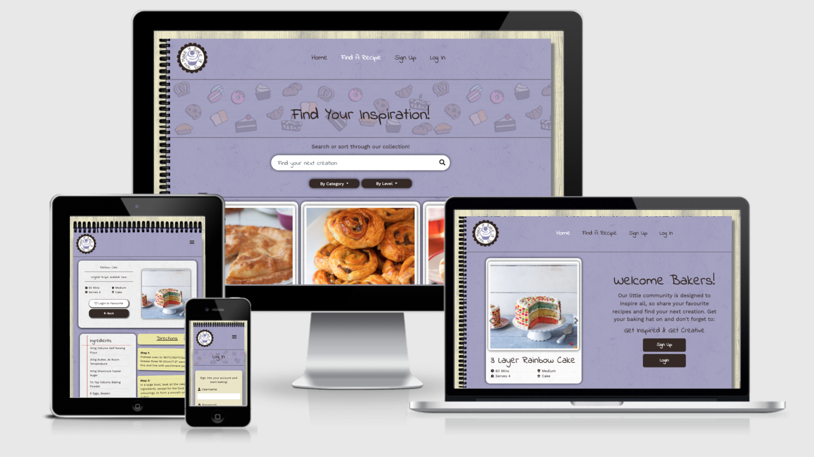
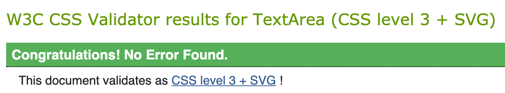
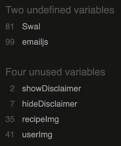
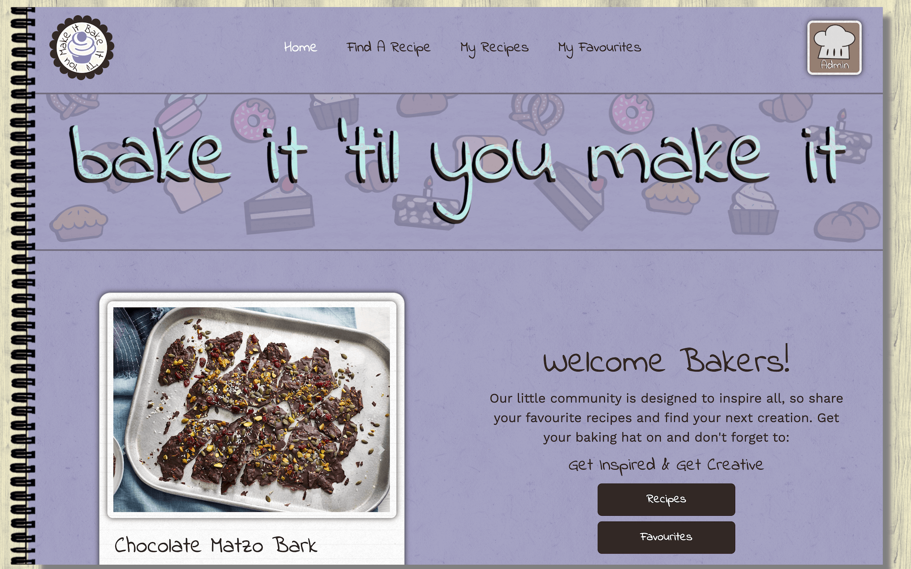
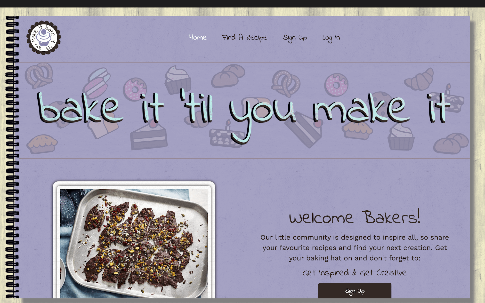
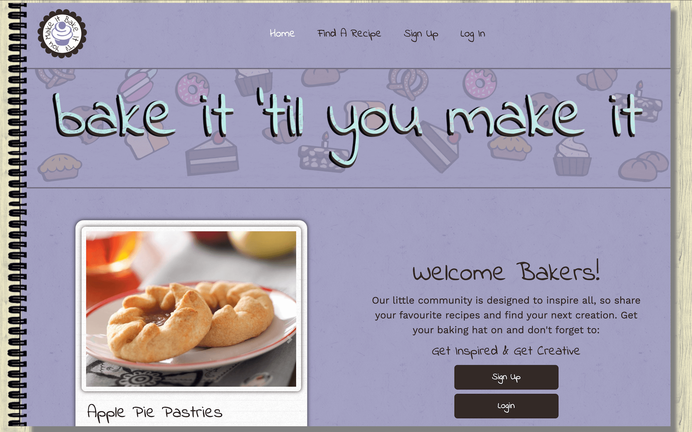
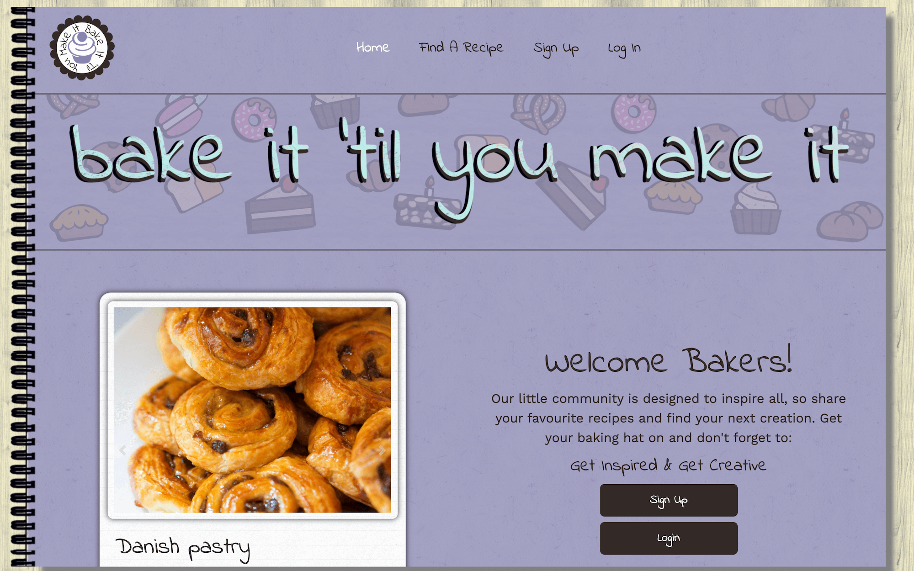
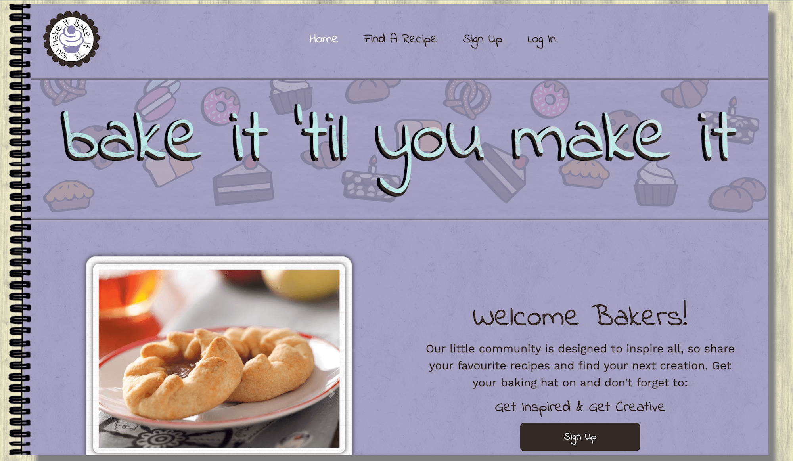

<h1 align="center">
     
</h1>

<h1 align="center"> Testing </h1>

[Main README.md file](README.md "Link to README file")

[View live project](https://bake-it-til-you-make-it.herokuapp.com/ "Link to Live project")

[View project Repository](https://github.com/rebeccatraceyt/bake-it-til-you-make-it "Link to Repository")

***
## Table of contents
1. [Testing User Stories](#Testing-User-Stories)
2. [Manual Testing](#Manual-Testing)
3. [Automated Testing](#Automated-Testing) 
     - [Code Validation](#Code-Validation)
     - [Browser Validation](#Browser-Validation)
     - [Lighthouse Auditing](#Lighthouse-Auditing)
4. [User Testing](#User-Testing)

***

***

## Testing User Stories

**General User**

1. As a General User, I want to intuitively find recipes on the database. 
    - On all pages, the **Find a Recipe** page is visible.
    - Clicking the **Find a Recipe** page, users will be able to view all recipes.
    - Using the search bar allows users to pinpoint their search.
    - Using the dropdown menu allows the user to refine their search.
2. As a General User, I want to view the selected recipe's dashboard to get necessary information.
    - Clicking either the **Recipe Image** or **Recipe Name** will direct the user to the recipe page.
    - There, all information pertaining to the recipe can be found.
3. As a General User, I want to seek contact information to send useful feedback to Developer / Site Owner.
    - On all pages the **Footer** is visible.
    - Selecting one of the **social** icons directs the user to:
        - The Developers LinkedIn page.
        - The Developers GitHub page.
        - The Contact Modal.

**Non-Registered User**

1. As a Non-Registered User, I want to navigate to Sign-Up page to Register an account.
    - A Non-Register User can click the **Sign Up** button on the **Home Page** or in the **Navigation Links** to be directed to the **Sign Up Page**.
    - There, they can enter their details and submit their registration.
    - On registering, they will be directed to the **My Recipes Page**.

**Registered User**

1. As a Registered User, I want to log into my account to gain access to the full functionality of the site.
    - Users can click the **Login** button on the **Home Page** or in the **Navigation Links** to be directed to the **Login Page**.
    - There, they can enter their login details.
    - On Login, they will be directed to the **My Recipes** page.
    - The conditional links will allow the user the full functionality of the site (Create, Read, Update, Delete).
2. As a Registered User, I want to navigate to my user profile to edit my account information.
    - On **My Recipes Page**, **My Favourites Page** and the user **quicklinks dropdown menu** (on larger screens only), the user can navigate to the **Edit Profile** page.
    - There, they can edit their account details (**username** and **image**).
    - Their current details will be the default values.
    - On clicking **Save**, they will be directed to **My Recipes**.
    - On clicking **Cancel**, they will be directed to **My Recipes**.
    - On clicking **Account Settings**, they will be directed to the **Edit Account** page.
3. As a Registered User, I want to navigate to my account settings to delete my account information.
    - On the **Edit Profile** page, the user can navigate to **Account Settings** in order to edit their password or delete their account.
    - On clicking **Save**, they will be directed to **Login**.
    - On clicking **Back**, they will be directed to **Edit Profile Page**.
    - On clicking **Delete Account**, the **Delete Modal** will open.
4. As a Registered User, I want to navigate to my recipes page to view my uploaded recipes.
    - If is user is logging in, they will be directed to **My Recipes**.
    - **My Recipes** can also be accessed through the **Navigation Links** or **My Favourites** page.
5. As a Registered User, I want to navigate to upload page to add my recipe to the database.
    - On **My Recipes Page**, **My Favourites Page** and the user **quicklinks dropdown menu** (on larger screens only), the user can navigate to the **Create Recipe** page.
6. As a Registered User, I want to view my own recipe's dashboard to edit recipe as needed.
    - If the user is viewing a **Recipe Page** where they are the recipe's author, the conditional buttons displayed will allow them to **edit** or **delete** the recipe.
    - Clicking **Edit** will bring them to the **Edit Recipe** page.
7. As a Registered User, I want to view my own recipe's dashboard to delete recipe.
    - If the user is viewing a **Recipe Page** where they are the recipe's author, the conditional buttons displayed will allow them to **edit** or **delete** the recipe.
    - Clicking **Delete** will open the **Delete Modal**.
8. As a Registered User, I want to use a save function to save my favourite recipes from other users.
    - If the user is viewing a **Recipe Page** where they are **NOT** the recipe's author, the conditional buttons displayed will allow them to **Add to favourites** or **Remove from Favourites**.
    - Clicking either will redirect the user back to the **Recipe Page**.
9. As a Registered User, I want to navigate to my favourites page to view the recipes I have saved from other users.
    - - **My Favourites** can be accessed through the **Navigation Links** or **My Recipes** page.

**Administrative Account Holder:**

1. As an Administrative Account holder, I want to view **any** recipe dashboard to edit recipe as needed.
    - The Administrative Accounts have 'admin privileges' that allow them to monitor all recipes entered.
    - If the  Administrative Account holder is viewing a **Recipe Page**, the conditional buttons displayed will allow them to **edit** the recipe.
    - Clicking **Edit** will bring them to the **Edit Recipe** page.
2. As an Administrative Account holder, I want to view **any** recipe dashboard to delete recipe as needed.
    - If the  Administrative Account holder is viewing a **Recipe Page**, the conditional buttons displayed will allow them to **delete** the recipe.
    - Clicking **Delete** will open the **Delete Modal**.
3. As an Administrative Account holder, I want to still maintain a save function to save my favourite recipes from other users.
    - - If the  Administrative Account holder is viewing a **Recipe Page**, the conditional buttons displayed will allow them to **Add to favourites** or **Remove from Favourites**.
    - Clicking either will redirect the user back to the **Recipe Page**.

[Back to top ⇧](#table-of-contents)

## Manual Testing

### Common Elements Testing
Manual testing was conducted on the following elements that appear on every page:

- Clicking the Logo located on the top-left of the screen will redirect the user back to the **Home Page**:

    

- Hovering over the **Navigation Links** will trigger the hover effect, confirming the page the user is on:

    

- Collapsible `hamburger` button on mobile and tablet devices reveals **Navigation** menu:

    

- Hovering over the **Footer** icons will trigger the hover effect, confirming the action the user is about to take:
    
    

- Clicking the **Footer Social Icons** opens the Developers social platform in a new tab:

    **GitHub:**
    

    **LinkedIn:**
    

- Clicking the **Footer Contact Icon** opens the contact modal, with the appropriate user feedback:

    

- Clicking the **Disclaimer** icon triggers the disclaimer notice: 

    

- If the User is logged in, their **user image** will be visible in the top-right of larger screens. Clicking on this will trigger the **dropdown** quick-links menu: 

    

### Home Page
Manual testing was conducted on the following elements on the **Home** Page:

- Using the **Carousel Controls**, the user can browse the featured recipes (the last four to be uploaded):

    

- Hovering over the **Call to Action** buttons will provide feedback to the user: 

    

- The Responsiveness of the **Home Page**:

    

### Find A Recipe Page
Manual testing was conducted on the following elements on the **Find A Recipe** Page:

- The Search Bar allows users to enter their search query:

    Results Found:
    

    No Results Found:
    

- The **Dropdown** Menus allow the user to filter their search:

    Category Search:
    

    Difficulty Search:
    

- The **Pagination** function only displays 6 recipes at a time, allowing the user to browse through pages:

    

- The Responsiveness of the **Find A Recipe Page**:

    

### Sign Up Page
Manual testing was conducted on the following elements on the **Sign Up** Page:

- User can enter their details into the input fields: 

    

- On entering the image url, an image preview will be displayed: 

    

- Passwords must match: 

    

- Hovering over the **Call to Action** buttons provide user feedback:

    

- Clicking **Login** redirects user to login page:

    

- Upon registering, user is directed to **My Recipes** page:

    

- The Responsiveness of the **Sign Up Page**:

    

### Login Page
Manual testing was conducted on the following elements on the **Login** Page:

- User can enter their details into the input fields:

    

- Clicking **Sign Up** redirects user to registration page:

    

- Upon login, user is directed to **My Recipes** page:

    

- The Responsiveness of the **Login Page**:

    

### My Recipes Page
Manual testing was conducted on the following elements on the **My Recipes** Page:

- Hovering over **Call to Action** buttons provide user feedback: 

    

- Clicking **Logout** redirects user back to login page:

    

### My Favourites Page
Manual testing was conducted on the following elements on the **My Favourites** Page:

- Hovering over **Call to Action** buttons provide user feedback: 

    

- Clicking **Logout** redirects user back to login page:

    

- The Responsiveness of the **My Favourites Page**:

    

### Edit User Page
Manual testing was conducted on the following elements on the **Edit User** Page:

- The Edit User page is only accessible from *login authenticated* pages: 
    
    My Recipes:
    

    My Favourites:
    

    Quicklinks:
    

- User can enter their details in the input fields (where their current information is the default value):

    

- On entering the image url, an image preview will be displayed: 

    

- **Call to action** buttons provide user feedback: 

    

- Clicking **Cancel** redirects user to My Recipes page:

    

- Clicking **Save** redirects user to My Recipes page:

    

- Clicking **Account Settings** directs user to **Edit Accounts Page**:

    

- The Responsiveness of the **Edit User Page**:

    

### Edit Accounts Page
Manual testing was conducted on the following elements on the **Edit Accounts** Page:

- Passwords must match:

    

-   Clicking **Back** redirects user to Edit Profile page:

    

- Clicking **Save** redirects user to Login page:

    

- Clicking **Delete Account** opens **Delete Modal**:

    

- The Responsiveness of the **Edit Accounts Page**:

    

### Create Recipe Page
Manual testing was conducted on the following elements on the **Create Recipe** Page:

- User can enter Recipe details:

    

- On adding an image url, an image preview will be displayed:
 
    

- User can use **Dropdown** menus to refine recipe:

    

- User can add and remove ingredients **dynamically**:

    

- User can add and remove directions **dynamically**:

    

- Clicking **Cancel** will return the user back to the previous page: 

    

- Clicking **Save** will redirect the user to My Recipes page: 

    

- The Responsiveness of the **Create Recipe Page**:

    

### Edit Recipe Page
Manual testing was conducted on the following elements on the **Edit Recipe** Page:

- User can enter Recipe details (current information will be the default value):

    

- On adding an image url, an image preview will be displayed:
 
    

- User can use **Dropdown** menus to refine recipe:

    

- User can add and remove ingredients **dynamically**:

    

- User can add and remove directions **dynamically**:

    

- Clicking **Cancel** will return the user back to the recipe page: 

    

- Clicking **Save** will redirect the user to the recipe page: 

    

- Clicking **Delete** opens **Delete Modal**:

    

- The Responsiveness of the **Create Recipe Page**:

    
 
### Recipe Page
Manual testing was conducted on the following elements on the **Recipe** Page:

- Clicking the recipe card (image or name) will direct the user to the Individual Recipe Page:

    Home Page:
    

    Find A Recipe:
    

    My Recipes:
    

    My Favourites:
    

- If the user is not logged in, the **Login To Add Favourites** Button will redirect them to the **Login** page: 

    

- If the user is **not** the recipe author, they can add the recipe to, or remove it from their Favourites:

    **Add to Favourites**:
    

    **Remove from Favourites**:
    

- If the user **is** the author, they can edit or delete the recipe:

    **Edit** directs to **Edit Recipe Page**:
    

    **Delete** opens the **Delete Modal**:
    

- The Responsiveness of the **Recipe Page**:

    

[Back to top ⇧](#table-of-contents)

## Automated Testing

### Code Validation

- [W3C Markup Validator](https://validator.w3.org/ "Link to W3C Markup Validator") was used to validate the `HTML` code used, using the `Validate by URI` method.

    - All errors highlighted and resolved, with the exception of the errors thrown by Jinja.

-  [W3C CSS Validator](https://jigsaw.w3.org/css-validator/ "Link to W3C CSS Validator") was used to validate the `CSS` code used.

    

- [JSHint](https://jshint.com/ "Link to JSHint") was used to validate the `JavaScript` and `JQuery` code used.

    - Errors highlighted in `script.js` pertain to [SweetAlert2](https://sweetalert2.github.io/ "Link to Sweet Alert 2 page") and [jQuery Validation](https://jqueryvalidation.org/ "Link to jQuery Validation page") as well as the `onclick` functions:

         

    - There were no errors highlighted in `recipe.js` file

- [PEP8 Online](http://pep8online.com/ "Link to PEP8 Online") was used to validate `Python` code.
    
    - All highlighted errors and warnings resolved.

### Browser Validation
**Chrome:**

**Safari:**

**Edge:**

**Opera:**

**Firefox:**

### Lighthouse Auditing

#### Desktop
| Page | Performance | Accessibility | Best Practice | SEO |
|------|:-------------:|:---------------:|:---------------:|:-----:|
| Home Page | 86% | 100% | 80% | 100% |
| Find Recipes | 99% | 92% | 80% | 90% |
| Login | 97% | 100% | 80% | 100% |
| Register | 99% | 100% | 80% | 100% |
| Edit User | 99% | 100% | 80% | 100% |
| Edit Account | 99% | 100% | 80% | 100% |
| My Recipes | 97% | 100% | 80% | 100% |
| My Favourites | 98% | 100% | 80% | 90% |
| Create Recipe | 99% | 100% | 80% | 100% |
| Edit Recipe | 98% | 90% | 80% | 100% |
| Recipe Page | 96% | 100% | 80% | 90% |

#### Mobile
| Page | Performance | Accessibility | Best Practice | SEO |
|------|:-------------:|:---------------:|:---------------:|:-----:|
| Home Page | 86% | 100% | 93% | 100% |
| Find Recipes | 73% | 92% | 93% | 90% |
| Login | 93% | 100% | 87% | 100% |
| Register | 92% | 100% | 87% | 100% |
| Edit User | 70% | 100% | 87% | 100% |
| Edit Account | 92% | 100% | 87% | 100% |
| My Recipes | 79% | 100% | 93% | 100% |
| My Favourites | 89% | 100% | 93% | 90% |
| Create Recipe | 92% | 100% | 87% | 100% |
| Edit Recipe | 82% | 90% | 87% | 100% |
| Recipe Page | 74% | 100% | 87% | 92% |

#### Breakdown of Results

| Page | Error / Warning | Comment |
|:-----:|:---------------:|:-------|
| All Pages | Largest Contentful Paint | The images rendered on each page threw this error due to a number of reasons. The developer was able to pre-load images rendered using the `rel="preload"` attribute in **HTML** and using `-webkit-image-set()` in **CSS** ([Source](https://web.dev/preload-responsive-images/)). The problem still persists due to the use of third party images throughout the site.|
| All Pages | Render-blocking resources | This warning stems from the use of `emailJS` for the contact form. The developer attempted to resolve this issue using the `defer` attribute within the script tag, but this only created an issue whereby the function sending the email was not called. |
| Home Page | Tap targets not sized appropriately | Relating to the carousel controls. Issue was resolved by resizing the anchor tag of the controls. |
| Home Page | Defer offscreen images | This relates to the carousel feature of the home page. The researched solution was to 'lazy-load' the images but that is not an option in this release due to the use of image urls, in lieu of uploads. |
| My Favourites | Links are not crawlable | Relating to the `.page-link` class in the Bootstrap Pagination controls. |
| All Pages | Avoid enormous network payload | This warning relates to the use of external images throughout the site. The payload size fluctuated significantly because of this. The solution to this would be to upload images directly to the site, but this feature is not included in this release |
| Find Recipes | Size Images | This issue (like many others before) pertains to the use of external images, where the resource size is far greater than the displayed size. |
| All Pages | Does not use HTTPS | In researching this error, the only conclusive reason for it is the use of mixed content throughout the site. |

[Back to top ⇧](#table-of-contents)

## User testing 
Family members and friends were asked to review the site and documentation to point out any bugs and/or user experience issues. Their helpful advice throughout the process led to many UX changes in order to create a better experience. 

It was through this testing that the following changes were made:
- Update to Logo to be more conventionally positioned. The original designs were for a floating logo but that was quickly replaced due to the issues it cause.
- Change to Recipe Card `font-size` and `max-length` in order to create consistency across all recipes. It was noted that some of the recipe names were longer than others, creating a spacing issue.
- Creating conditional buttons for each category in order to better distinguish the differences.
- Creating a 'quick-links' function for users to create a more streamline experience.
- Creating a separate **Accounts Settings** page just for changing password or deleting account, in order to avoid the "danger" zone as much as possible.

[Back to top ⇧](#table-of-contents)

***